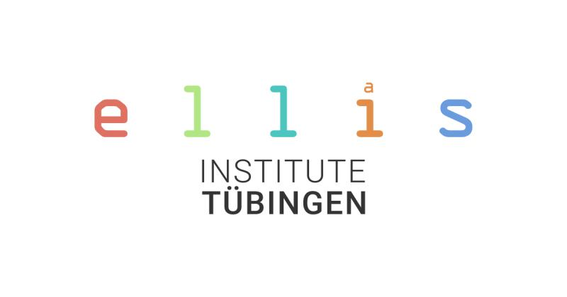
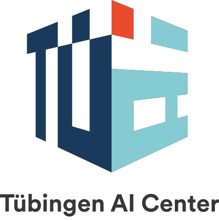

# BUD-E: A conversational and empathic AI Voice Assistant

BUD-E (Buddy for Understanding and Digital Empathy) is an open-source AI voice assistant which aims for the following goals:

1. replies to user requests in real-time
2. uses natural voices, empathy & emotional intelligence
3. works with long-term context of previous conversations
4. handles multi-speaker conversations with interruptions, affirmations and thinking pauses
5. runs fully local, on consumer hardware.

This project is a collaboration between LAION, the ELLIS Institute Tübingen, Collabora and the Tübingen AI Center.

<p align="center", style="margin-top:30px;">
  <a href="https://laion.ai/"> </a>
  <a href="https://institute-tue.ellis.eu/"></a>
  <a href="https://www.collabora.com/"></a>
  <a href="https://tuebingen.ai/"></a>

</p>

[This demo](https://youtu.be/SYWDucn8RL8) shows an interaction with the current version of BUD-E on an NVIDIA RTX 4090. With this setup, the voice assistant answers with a latency of *300 to 500 milliseconds*.  

## Quick Start
1. Clone this repository and follow the installation guide in the readme.
2. Start the voice assistant by running the *main.py* file in the repository root.
3. Wait until "Listening.." is printed to the console and start speaking. 


## Roadmap
Altough the conversations with the current version of BUD-E already feel quite natural, there are still a lot of components and features missing what we need to tackle on the way to a truly and naturally feeling voice assistant. The immediate open work packages we'd like to tackle are as follows:

### Reducing Latency & minimizing systems requirements
- [ ] *Quantization*. Implement more sophisticated quantization techniques to reduce VRAM requirements and reduce latency.
- [ ] *Fine-tuning streaming TTS*. TTS systems normally consume full sentences to have enough context for responses. To enable high-quality low-latency streaming we give the TTS context from hidden layers of the LLM and then fine-tune the streaming model on a high-quality teacher (following https://arxiv.org/abs/2309.11210).
- [ ] *Fine-tuning streaming STT*. Connect hidden layers from STT and LLM system and then fine-tune on voice tasks to maximize accuracy in low-latency configurations of STT model.
- [ ] *End-of-Speech detection*. Train and implement a light-weight end-of-speech detection model.
- [ ] *Implement Speculative Decoding*. Implement speculative decoding to increase inference speed in particular for the STT and LLM models.

### Increasing Naturalness of Speech and Responses

- [ ] *Dataset of natural human dialogues*. Build a dataset (e.g., Youtube, Mediathek, etc.) with recorded dialogues between two or more humans for fine-tuning BUD-E.
- [ ] *Reliable speaker-diarization*. Develop a reliable speaker-diarization system that can separate speakers, including utterances and affirmations that might overlap between speakers.
- [ ] *Fine-tune on dialogues*. Finetune STT -> LLM -> TTS pipeline on natural human dialogues to allow the model to respond similarly to humans, including interruptions and utterances.

### Keeping track of conversations over days, months and years

- [ ] *Retrieval Augmented Generation (RAG)*. Implement RAG to extend knowledge of BUD-E, unlocking strong performance gains (cp. https://www.pinecone.io/blog/rag-study/).
- [ ] *Conversation Memory*. Enable model to save information from previous conversations in vector database to keep track of previous conversations.

### Enhancing functionality and ability of voice assistant

- [ ] *Tool use*. Implement tool use into LLM and the framework, e.g., to allow the agent to perform internet searches

### Enhancing multi-modal and emotional context understanding

- [ ] *Incorporate visual input*. Use a light-weight but effective vision encoder (e.g., CLIP or a Captioning Model) to incorporate static image and/or video input.
- [ ] *Continuous vision-audio responses*. Similar to the (not genuine) [Gemini demo](https://www.youtube.com/watch?v=UIZAiXYceBI) it would be great if BUD-E would naturally and continuously take into account audio and vision inputs and flexibly respond in a natural manner just like humans.
- [ ] *Evaluate user emotions*. Capture webcam images from the user to determine the user’s emotional state and incorporate this in the response. This could be an extension of training on dialogues from video platforms, using training samples where the speaker’s face is well visible.

### Building a UI, CI  and easy packaging infrastructure

- [ ] *LLamaFile*. Allow easy cross-platform installation and deployment through a single-file distribution mechanism like Mozilla’s LLamaFile.
- [ ] *Animated Avatar*. Add a speaking and naturally articulating avatar similar to Meta’s Audio2Photoreal but using simpler avatars using 3DGS-Avatar [https://neuralbodies.github.io/3DGS-Avatar/].
- [ ] *User Interface*. Capture the conversation in writing in a chat-based interface and ideally include ways to capture user feedback.
- [ ] *Minimize Dependencies*. Minimize the amount of third-party dependencies.
- [ ] *Cross-Platform Support*. Enable usage on Linux, MacOS and Windows.
- [ ] *Continuous Integration*. Build continuous integration pipeline with cross-platform speed tests and standardized testing scenarios to track development progress.

### Extending to multi-language and multi-speaker

- [ ] *Extend streaming STT to more languages*. Extending to more languages, including low-resource ones, would be crucial.
- [ ] *Multi-speaker*. The baseline currently expects only a single speaker, which should be extended towards multi-speaker environments and consistent re-identification of speakers.


## Installation
The current version of BUD-E contains the following pretrained models:

- Speech to Text Model: [FastConformer Streaming STT by NVIDIA](https://catalog.ngc.nvidia.com/orgs/nvidia/teams/nemo/models/stt_en_fastconformer_hybrid_large_streaming_80ms)
- Language Model: [Microsoft Phi-2](https://huggingface.co/microsoft/phi-2)
- Text to Speech Model: [StyleTTS2](https://github.com/yl4579/StyleTTS2)

The model weights are downloaded and cached automatically when running the inference script for the first time. 

To install BUD-E on your system follow these steps: 

### 1) Setup Environment and Clone the Repo 
We recommend to create a fresh conda environment with python 3.10.12.
```
conda create --name bud_e python==3.10.12
conda activate bud_e
```

Next, clone this repository. Make sure to pass the *-recurse-submodules* argument to clone the required submodules as well.
```
git clone --recurse-submodules https://github.com/LAION-AI/natural_voice_assistant.git
```

### 2) Install espeak-ng
#### Ubuntu:
```
sudo apt-get install festival espeak-ng mbrola 
```

#### Windows:
- Download and run the latest espeak-ng msi installer via https://github.com/espeak-ng/espeak-ng/releases
- Add the path to the libespeak-ng.dll file to your conda environment:
```
conda env config vars set PHONEMIZER_ESPEAK_LIBRARY="C:\Program Files\eSpeak NG\libespeak-ng.dll"
```
- Reactivate your conda environment

### 3) Install pytorch
Install *torch* and *torchaudio* using the configurator on https://pytorch.org/

### 4) Install Required Python Packages
Inside the repository run: 
```
pip install -r requirements.txt
```

On Ubuntu, you might install portaudio which is required by pyaudio. If you encounter any errors with pyaudio, try to run: 
```
sudo apt install portaudio19-dev
```

### 5) Start your AI conversation
- Start BUD-E by running the *main.py* file inside the repository:
```
python main.py
```
- Wait until all checkpoints are downloaded and all models are initialized. When *"## Listening..."* is prompted to the console, you can start speaking.  

- When starting the main.py a list of available audio devices is displayed in the terminal. By default the device with index 0 is used for recording. To select a specific audio device, you can use the *--audio-device-idx* argument and pass the device index you want to use. 


## Command-Line Arguments

Below are the available command-line arguments for starting the assistant:

| Argument      | Description                           | Default Value |
|---------------|---------------------------------------|---------------|
| `--audio-device-idx`| Select the audio device by index that should be used for recording. If no device idex is selected, the default audio device will be used.      | `None`           |
| `--audio-details` | Show details for the selcted audio device like the sample rate or number of audio channels. | `false`       |
| `--tts-model` | Select the model that should be used for text to speech. You can choose between `StyleTTS2` and `WhisperSpeech`. Please note that `WhisperSpeech` relies on `torch.compile` which is not supported on windows. You can still use `WhisperSpeech` on Windows but the TTS inference will be very slow.| `StyleTTS2`       |


## Troubleshooting 

##### OSError: [Errno -9999] Unanticipated host error
This error could occur, if access to your audio device is denied. Please check your local settings and allow desktop apps to access the microphone. 

##### OSError "invalid samplerate" or "invalid number of channels"
These are pyaudio related issues that occur if the selected audio device does not support the current sample rate or number of channels. Sample rate and channels are selected automatically regarding the current audio-device index that is used. If you encounter any problems related to pyaudio, use the --audio-device-idx argument and try a different device id. A list of all available audio-devices is printed when executing main.py. 


## Collaborating to Build the Future of Conversational AI

The development of BUD-E is an ongoing process that requires the collective effort of a diverse community. We invite open-source developers, researchers, and enthusiasts to join us in refining BUD-E's individual modules and contributing to its growth. Together, we can create an AI voice assistants that engage with us in natural, intuitive, and empathetic conversations.

If you're interested in contributing to this project, join our [Discord community](https://discord.com/invite/jJpvt6R8cp) or reach out to us at [bud-e@laion.ai](mailto:bud-e@laion.ai).
